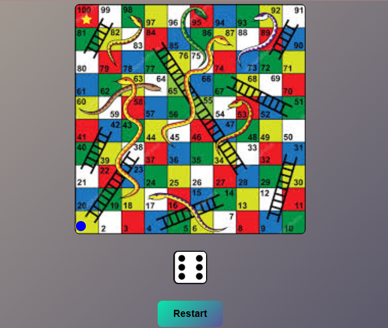

# 🎲 Interactive Snake & Ladder Game (Development Workspace)

Welcome to the active development repository for the **Snake & Ladder Arcade Web Game**. This project is engineered utilizing vanilla web parameters to simulate the classic board game physics, featuring dynamic player token grid shifting, real-time dice rolls, and interactive state triggers.

The core logical engine monitors player tile index arrays, executing instant teleportation matrices whenever a token encounters a snake's coordinate head or a ladder's baseline node.

---

## 🤵 Repository Host Details

- **Author Name:** amir
- **GitHub Profile Alias:** [amirsohail100](https://github.com/amirsohail100)
- **Official Communication Endpoints:** amirsoahil10@gmail.com
- **Project Status:** Active Development (Beta Phase) 🟡

---

## 🖥️ Graphical User Interface Preview (UI Showcase)

Below is the early-stage operational layout of the game board grid matrix, showing the action buttons and active rendering tracking boundaries from my workspace:

<div align="center">
  
  <p><i>Active Workspace — 10x10 Core Grid Board, Interactive Random Dice Controller, and Token Mechanics</i></p>
</div>

---

## 📂 Source Code Architecture

The framework splits execution paths cleanly across three fundamental layers to support scalable modular upgrades:

- **`index.html`:** Generates the semantic base container layout, board cells canvas, and active utility HUD dashboards.
- **`style.css`:** Implements structural grid mappings, visual tile numbering, custom theme configurations, and fluid token transition boundaries.
- **`app.js` (or core script):** Coordinates the game loop. It handles randomization (`Math.random()`) for dice mechanics, checks coordinate collision objects (Snakes/Ladders), and updates local state indexes.

---

## 🛠️ Core Features & Algorithmic Milestones

- **Dynamic Grid Array Engineering:** Utilizes absolute positioning profiles or flexible layout rows to generate a balanced 100-tile board array natively.
- **Randomized Dice Pipeline:** Programmed pseudo-random calculation formulas to loop integers from 1 to 6 seamlessly upon user action clicks.
- **Snake/Ladder Teleportation Matrix:** Uses key-value conditional index checking:
  - **Snake Collision:** Instantly translates active position variables from the designated _Head Node_ back down to the target _Tail Node_.
  - **Ladder Collision:** Elevates positional coordinates directly from the _Base Node_ straight up to the _Top End Node_.
- **State Boundaries Enforcement:** Restricts the core system from rendering indexes past the maximum terminal boundary (Tile 100) to safely lock the win state loop.

---

## 💻 Technical Stack Components

- **Structural Skeleton:** Semantic HTML5 Container Nodes
- **Visual Blueprint:** Custom CSS3 (Flexible Arrays, Box Layout Shifting, Active Transitions)
- **Logic Processing Engine:** Vanilla ES6+ JavaScript (State Tracking, Integer Math Pipelines, Dynamic Class Toggles)

---

## 🚀 How to Run and Test the Beta Locally

Follow these basic guidelines to pull and launch the development workspace instantly:

### 1. Clone the Target Terminal Endpoint

```bash
git clone [https://github.com/amirsohail100/Memory_Matrix_Game.git](https://github.com/amirsohail100/Memory_Matrix_Game.git)
cd Memory_Matrix_Game
```
